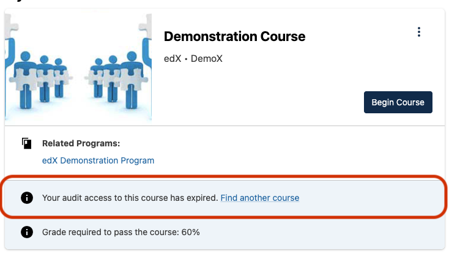

# Course Card Action Slot

### Slot ID: `org.openedx.frontend.learner_dashboard.course_card_banner.v1`
### Props:
* `cardId`

## Description

This slot is used for replacing or adding content for the `CourseBanner` component. This banner is rendered as a child of the `CourseCard`.

The default CourseBanner looks like this when audit access has expired for the course:


## Example

The following `env.config.jsx` will render a custom implemenation of a CourseBanner under every `CourseCard`.


```js
import { DIRECT_PLUGIN, PLUGIN_OPERATIONS } from '@openedx/frontend-plugin-framework';
import { Alert } from '@openedx/paragon';

const config = {
  pluginSlots: {
    'org.openedx.frontend.learner_dashboard.course_card_banner.v1': {
      keepDefault: false,
      plugins: [
        {
          op: PLUGIN_OPERATIONS.Insert,
          widget: {
            id: 'org.openedx.frontend.learner_dashboard.course_card_banner.v1',
            type: DIRECT_PLUGIN,
            priority: 60,
            RenderWidget: ({ cardId }) => (
              <Alert variant="info" className="mb-0">
                Course banner for course with {cardId}
              </Alert>
            ),
          },
        },
      ],
    },
  },
}

export default config;
```
