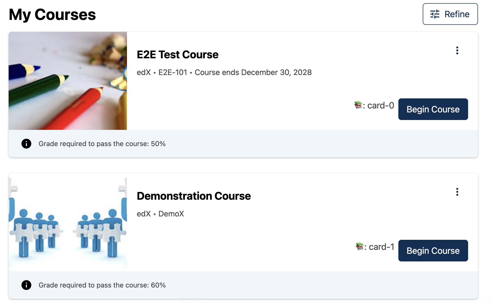

# Course Card Action Slot

### Slot ID: `org.openedx.frontend.learner_dashboard.course_card_action.v1`

### Slot ID Aliases
* `course_card_action_slot`

### Props:
* `cardId`

## Description

This slot is used for adding content in the Action buttons section of each Course Card.

## Example

The following `env.config.jsx` will render the `cardId` of the course as `<p>` elements in a `<div>`.



```js
import { DIRECT_PLUGIN, PLUGIN_OPERATIONS } from '@openedx/frontend-plugin-framework';
import ActionButton from 'containers/CourseCard/components/CourseCardActions/ActionButton';

const config = {
  pluginSlots: {
    'org.openedx.frontend.learner_dashboard.course_card_action.v1': {
      keepDefault: false,
      plugins: [
        {
          // Insert Custom Button in Course Card
          op: PLUGIN_OPERATIONS.Insert,
          widget: {
            id: 'custom_course_card_action',
            priority: 60,
            type: DIRECT_PLUGIN,
            RenderWidget: ({cardId}) => (
              <ActionButton
                variant="outline-primary"
              >
                Custom Button
              </ ActionButton>
            ),
          },
        },
          {
            // Insert Another Button in Course Card
            op: PLUGIN_OPERATIONS.Insert,
            widget: {
              id: 'another_custom_course_card_action',
              priority: 70,
              type: DIRECT_PLUGIN,
              RenderWidget: ({cardId}) => (
                <ActionButton
                  variant="outline-primary"
                >
                  📚: {cardId}
                </ ActionButton>
              ),
            },
        },
      ]
    }
  },
}

export default config;
```
