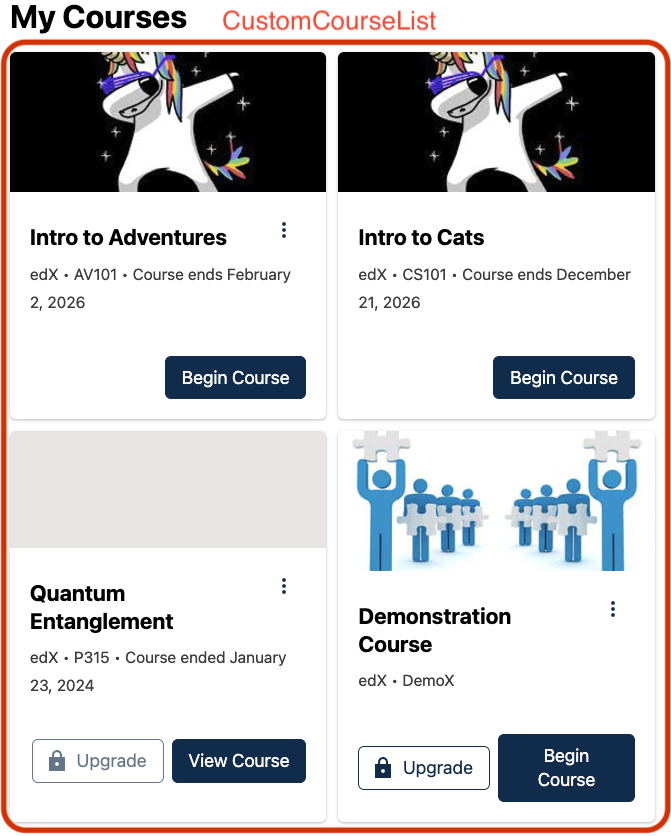

# Course List Slot

### Slot ID: `course_list_slot`

## Description

This slot is used for replacing or adding content around the `CourseList` component. The `CourseListSlot` is only rendered if the learner has enrolled in at least one course.

## Example

The space will show the `CourseList` component by default. This can be disabled in the configuration with the `keepDefault` boolean. 


Setting the MFE's `env.config.jsx` to the following will replace the default experience with a `CustomCourseList` component.



```js
import { DIRECT_PLUGIN, PLUGIN_OPERATIONS } from '@openedx/frontend-plugin-framework';
import { CustomCourseList } from '<package-that-exports-your-component>'

const config = {
  pluginSlots: {
    course_list_slot: {
      keepDefault: false,
      plugins: [
        {
          op: ops.Insert,
          widget: {
            id: 'custom_course_list',
            type: DIRECT_PLUGIN,
            priority: 60,
            RenderWidget: CustomCourseList,
          },
        },
      ],
    },
  },
}

export default config;
```