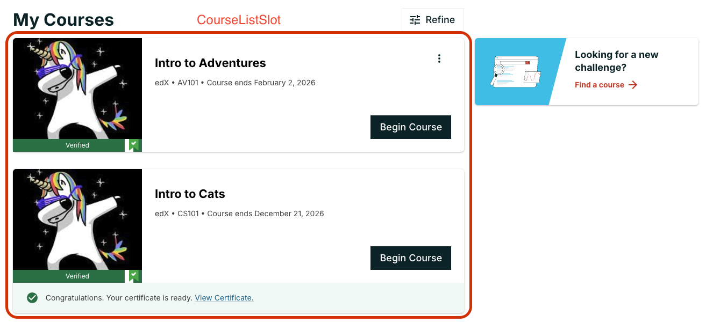
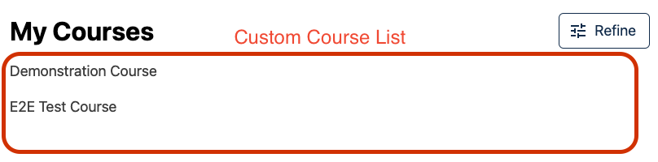

# Course List Slot

### Slot ID: `org.openedx.frontend.learner_dashboard.course_list.v1`

### Slot ID Aliases
* `course_list_slot`

## Plugin Props

* courseListData

## Description

This slot is used for replacing or adding content around the `CourseList` component. The `CourseListSlot` is only rendered if the learner has enrolled in at least one course.

## Example

The space will show the `CourseList` component by default. This can be disabled in the configuration with the `keepDefault` boolean. 



Setting the MFE's `env.config.jsx` to the following will replace the default experience with a list of course titles.



```js
import { DIRECT_PLUGIN, PLUGIN_OPERATIONS } from '@openedx/frontend-plugin-framework';

const config = {
  pluginSlots: {
    'org.openedx.frontend.learner_dashboard.course_list.v1': {
      // Hide the default CourseList component
      keepDefault: false,
      plugins: [
        {
          op: PLUGIN_OPERATIONS.Insert,
          widget: {
            id: 'custom_course_list',
            type: DIRECT_PLUGIN,
            priority: 60,
            RenderWidget: ({ courseListData }) => {
              // Extract the "visibleList"
              const courses = courseListData.visibleList;
              // Render a list of course names
              return (
                <div>
                  {courses.map(courseData => (
                    <p>
                      {courseData.course.courseName}
                    </p>
                  ))}
                </div>
              )
            },
          },
        },
      ],
    },
  },
}

export default config;
```