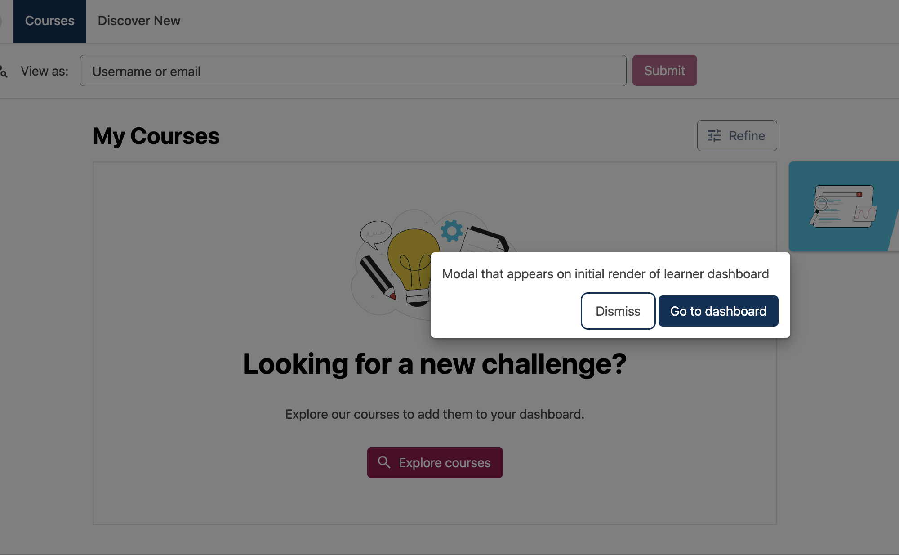

# Course Card Action Slot

### Slot ID: `dashboard_modal_slot`

## Description

This slot is used for the modal on a dashboard that appears on initial load.
The following `env.config.jsx` will render the modal.

## Example

Learner dashboard will show modal on initial load


```js
import { DIRECT_PLUGIN, PLUGIN_OPERATIONS } from '@openedx/frontend-plugin-framework';
import { ModalDialog } from '@openedx/paragon';

const config = {
  pluginSlots: {
    dashboard_modal_slot: {
      plugins: [
        {
          op: PLUGIN_OPERATIONS.Insert,
          widget: {
            id: 'dashboard_modal',
            type: DIRECT_PLUGIN,
            priority: 60,
            RenderWidget: 
              <ModalDialog title="Modal that appears on initial render of learner dashboard" />,
          },
        },
      ],
    }
  },
}

export default config;
```
