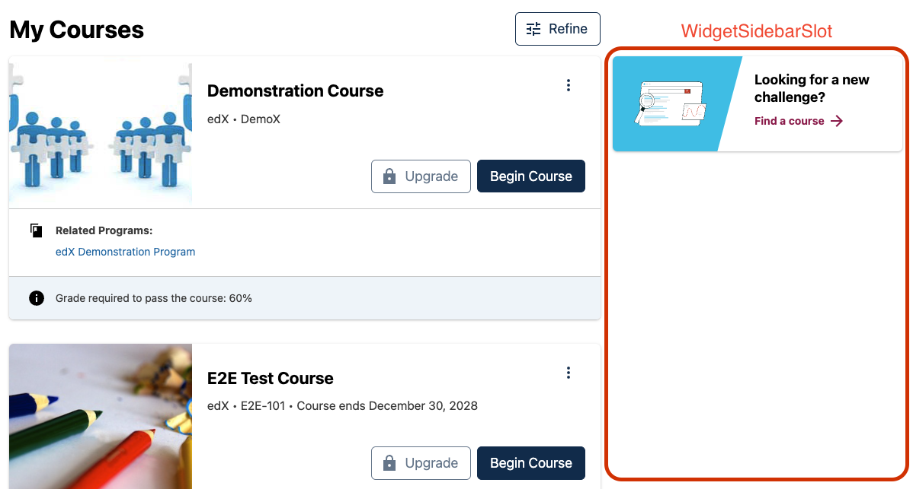
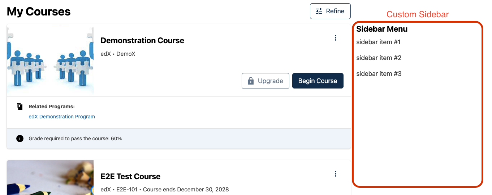

# Widget Sidebar Slot

### Slot ID: `org.openedx.frontend.learner_dashboard.widget_sidebar.v1`

### Slot ID Aliases
* `widget_sidebar_slot`

## Description

This slot is used for adding content to the right-hand sidebar.

## Example

The space will show the `LookingForChallengeWidget` by default. This can be disabled in the configuration with the `keepDefault` boolean.



Setting the MFE's `env.config.jsx` to the following will replace the default experience with a custom sidebar component.



```js
import { DIRECT_PLUGIN, PLUGIN_OPERATIONS } from '@openedx/frontend-plugin-framework';

const config = {
  pluginSlots: {
     'org.openedx.frontend.learner_dashboard.widget_sidebar.v1': {
      // Hide the default LookingForChallenge component
      keepDefault: false,
      plugins: [
        {
          op: PLUGIN_OPERATIONS.Insert,
          widget: {
            id: 'custom_sidebar_panel',
            type: DIRECT_PLUGIN,
            priority: 60,
            RenderWidget: () => (
              <div>
                <h3>
                  Sidebar Menu
                </h3>
                <p>
                  sidebar item #1
                </p>
                <p>
                  sidebar item #2
                </p>
                <p>
                  sidebar item #3
                </p>
              </div>
            ),
          },
        },
      ],
    },
  },
}

export default config;
```