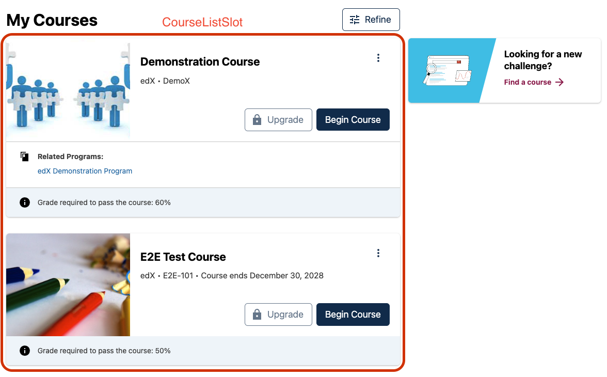

# Course List Slot

### Slot ID: `org.openedx.frontend.slot.learnerDashboard.courseList.v1`

### Slot Props

* `courseListData`

## Description

This slot is used for replacing or adding content around the `CourseList` component. The `CourseListSlot` is only rendered if the learner has enrolled in at least one course.

## Example

The space will show the `CourseList` component by default.



Using the following configuration will replace the slot's default content with a list of course titles.


```js
import { WidgetOperationTypes } from '@openedx/frontend-base';

const myComponent = ({ courseListData }) => {
  // Extract the "visibleList"
  const courses = courseListData.visibleList;

  // Render a list of course names
  return (
    <div>
      {courses.map(courseData => (
        <p>
          {courseData.course.courseName}
        </p>
      ))}
    </div>
  )
}

const config = {
  slots: [
    {
      slotId: 'org.openedx.frontend.slot.learnerDashboard.courseList.v1',
      id: 'my.widget',
      op: WidgetOperationTypes.REPLACE,
      component: myComponent
    },
  ]
}

export default config;
```
