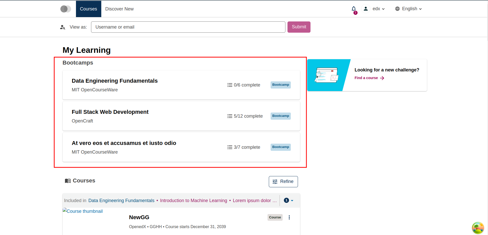
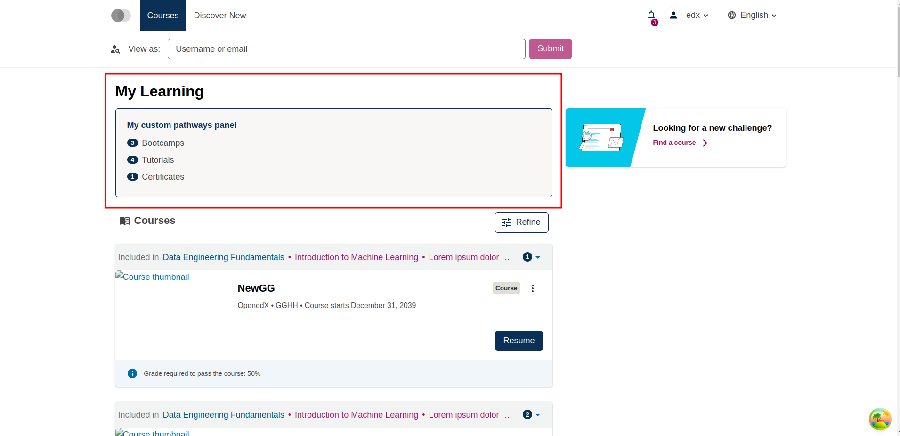

# Pathways Panel Slot

### Slot ID: `org.openedx.frontend.slot.learnerDashboard.pathwaysPanel.v1`

### Slot Props

* `pathwaysByCategory`

## Description

This slot is used for replacing or adding content around the `PathwaysPanel` component, which lists the learner's pathways grouped by category.

## Example

The space will show the `PathwaysPanel` component by default.



Using the following configuration will replace the slot's default content with a summary of how many pathways the learner has in each category.



```js
import { WidgetOperationTypes } from '@openedx/frontend-base';

const myComponent = ({ pathwaysByCategory }) => (
  <div className="border border-primary rounded bg-light-200 p-4 mb-4">
    <h3 className="h4 text-primary">My custom pathways panel</h3>
    <ul className="list-unstyled mb-0">
      {pathwaysByCategory.map(({ categoryLabelPlural, pathways }) => (
        <li key={categoryLabelPlural} className="d-flex align-items-center py-1">
          <span className="badge badge-pill badge-primary mr-2">{pathways.length}</span>
          {categoryLabelPlural}
        </li>
      ))}
    </ul>
  </div>
);

const config = {
  slots: [
    {
      slotId: 'org.openedx.frontend.slot.learnerDashboard.pathwaysPanel.v1',
      id: 'my.widget',
      op: WidgetOperationTypes.REPLACE,
      relatedId: 'defaultContent',
      component: myComponent,
    },
  ],
};

export default config;
```
